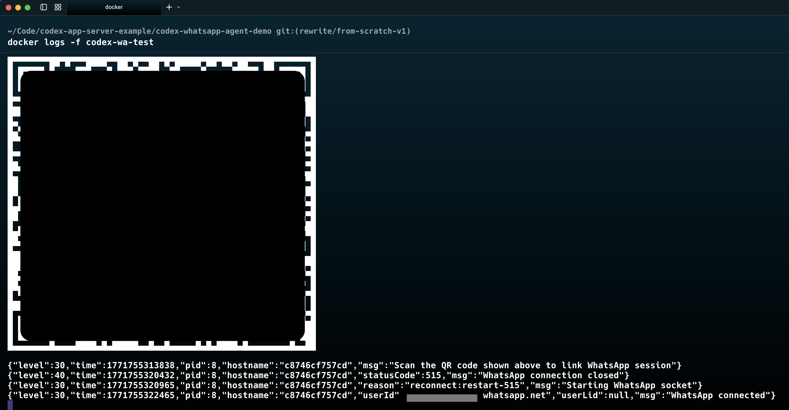
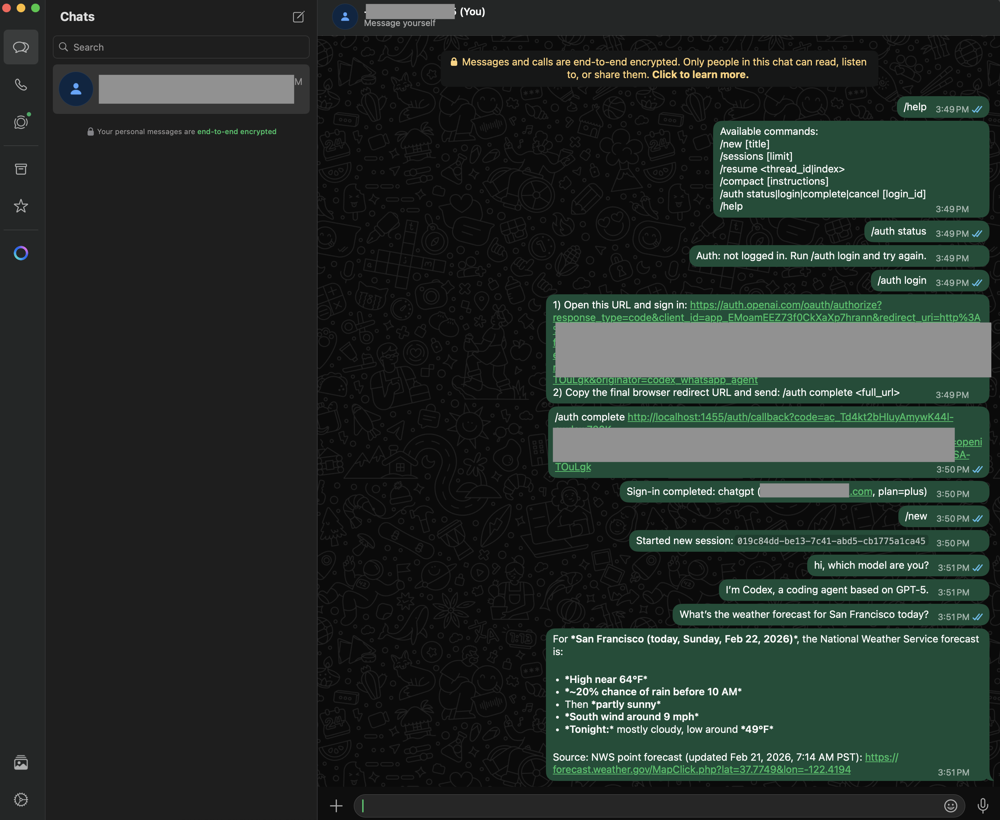

# WhatsApp Codex Agent

Single-container WhatsApp interface for Codex app-server with chat/research-focused behavior, slash-command control, auth relay, and restart-safe persistence.

## Features

- **Access Modes**:
  - `self_chat`: Only processes messages matching the account's own identity
  - `approved_senders`: Only processes messages from allowlisted sender identities
- **Slash Commands**: `/help`, `/new`, `/sessions`, `/resume`, `/compact`, `/auth`
- **Research-Only Policy**: Blocks command execution, file changes, and other non-research actions
- **Session Recovery**: Auto-recovers when Codex returns "thread not found"
- **OAuth Relay**: Manual ChatGPT auth flow via `/auth login` and `/auth complete`

---

## Getting Started

### Prerequisites

- **Docker** — For running the container
- **WhatsApp account** — With a phone that can scan QR codes
- **uv** and **make** — For local development and running checks

### Step 1: Build and Run

From the parent directory containing `codex-whatsapp-agent-demo`:

```bash
# Build the Docker image
docker build -t codex-wa-rewrite -f codex-whatsapp-agent-demo/Dockerfile .

# Run the container
docker run -d \
  --name codex-wa-test \
  -p 18000:8000 \
  -p 13001:3001 \
  -e CODEX_MODEL=gpt-5.3-codex \
  -e WHATSAPP_ACCESS_MODE=self_chat \
  -v "$(pwd)/codex-whatsapp-agent-demo/data:/app/data" \
  codex-wa-rewrite
```

### Step 2: Verify Health

```bash
# Check app health
curl http://127.0.0.1:18000/health
# Expected: {"status":"ok"}

# Check sidecar health
curl http://127.0.0.1:13001/health
# Expected: {"status":"ok","mockMode":false,"connected":false}
```

### Step 3: Scan QR Code

View the container logs to see the QR code:

```bash
docker logs -f codex-wa-test
```

You'll see a QR code in the terminal:



1. Open WhatsApp on your phone
2. Go to **Settings → Linked Devices → Link a Device**
3. Scan the QR code from the terminal

Once connected, the logs will show:
```
{"level":30,"msg":"WhatsApp connected","userId":"...@s.whatsapp.net"}
```

And the health check will show `"connected":true`:
```bash
curl http://127.0.0.1:13001/health
# {"status":"ok","mockMode":false,"connected":true}
```

### Step 4: Test Commands and Authenticate

Since we're in `self_chat` mode, **send messages to yourself** in WhatsApp. The full flow:



1. **`/help`** — Shows available commands
2. **`/auth status`** — Shows "Auth: not logged in"
3. **`/auth login`** — Provides a sign-in URL
4. **Open the URL** in your browser and sign in to ChatGPT
5. **Copy the redirect URL** from your browser (starts with `http://localhost:1455/auth/callback?code=...`)
6. **`/auth complete <paste full URL>`** — Completes authentication
7. **`/auth status`** — Should now show "chatgpt" with your email
8. **`/new`** — Starts a new conversation session
9. **Send a message** — Test with any question!

### Step 5: Validate Setup

Run the quality checks to ensure everything is working:

```bash
cd codex-whatsapp-agent-demo
make check
```

This runs:
- `ruff format --check` — Code formatting
- `ruff check` — Linting
- `mypy --strict` — Type checking
- `pytest` — Unit tests
- `node --check` — Sidecar JS validation

Expected output: All checks pass.

---

## Troubleshooting

### No response to WhatsApp messages

1. Check container is running: `docker ps | grep codex-wa-test`
2. Check health endpoints:
   ```bash
   curl http://127.0.0.1:18000/health
   curl http://127.0.0.1:13001/health
   ```
3. Check sidecar is connected: `"connected":true` in sidecar health
4. Check logs for errors: `docker logs codex-wa-test`

### `/auth complete` fails

- Ensure you copied the **full redirect URL** including all query parameters
- The URL should contain `code=` and `state=` parameters
- If it says "page not found" in browser, that's expected — just copy the URL anyway
- Try `/auth login` again to get a fresh auth URL
- Note: after callback replay, the app intentionally restarts the Codex subprocess to refresh in-memory auth state so `/auth status` updates without restarting the container

### QR code expired or connection drops

```bash
# Restart the container
docker restart codex-wa-test

# Watch logs for new QR code
docker logs -f codex-wa-test
```

### Starting fresh

To reset all state and start over:

```bash
# Stop and remove container
docker stop codex-wa-test && docker rm codex-wa-test

# Clear data directory
rm -rf codex-whatsapp-agent-demo/data
mkdir -p codex-whatsapp-agent-demo/data

# Rebuild and run
docker build -t codex-wa-rewrite -f codex-whatsapp-agent-demo/Dockerfile .
docker run -d \
  --name codex-wa-test \
  -p 18000:8000 \
  -p 13001:3001 \
  -e CODEX_MODEL=gpt-5.3-codex \
  -e WHATSAPP_ACCESS_MODE=self_chat \
  -v "$(pwd)/codex-whatsapp-agent-demo/data:/app/data" \
  codex-wa-rewrite
```

---

## Architecture

```
WhatsApp Network
   │
   ▼
Node.js Sidecar (Baileys)
   │  HTTP (localhost)
   ▼
FastAPI Orchestrator (Python)
   │  stdio JSON-RPC
   ▼
Codex app-server (via SDK)
```

See [`AGENTS.md`](AGENTS.md) for coding guidelines.

## Dependencies

This project uses [`codex-app-server-client`](https://pypi.org/project/codex-app-server-client/) — a Python SDK for the Codex app-server protocol that we also maintain. Source: [github.com/paras-anekantvad/codex-app-server-client-sdk](https://github.com/paras-anekantvad/codex-app-server-client-sdk)

## Project Structure

```
├── src/app/
│   ├── main.py           # FastAPI endpoints, inbound processing
│   ├── service.py        # ChatService, command handling
│   ├── codex_client.py   # SDK wrapper for Codex
│   ├── store.py          # SQLite persistence
│   ├── config.py         # Settings (Pydantic)
│   ├── models.py         # Shared Pydantic models
│   ├── policy.py         # Item type allowlist
│   ├── auth_relay.py     # OAuth callback replay
│   ├── command_parser.py # Slash command parsing
│   └── system_prompt.py  # Research-only instructions
├── sidecar/
│   └── src/              # Node.js Baileys sidecar
├── tests/                # pytest tests
├── docs/PRD.md           # Product requirements
└── Makefile              # Dev workflow commands
```

## Makefile Commands

| Command | Description |
|---------|-------------|
| `make install` | Install all dependencies |
| `make check` | Run all quality gates |
| `make pre-commit` | Alias for check |
| `make format` | Check code formatting |
| `make format-fix` | Fix code formatting |
| `make lint` | Run linter |
| `make lint-fix` | Fix lint issues |
| `make type-check` | Run mypy --strict |
| `make test` | Run pytest |
| `make fix` | Auto-fix formatting and lint |
| `make clean` | Remove caches and .venv |
| `make dev` | Run development server |

## Environment Variables

| Variable | Default | Description |
|----------|---------|-------------|
| `WHATSAPP_ACCESS_MODE` | `self_chat` | Access mode: `self_chat` or `approved_senders` |
| `WHATSAPP_APPROVED_NUMBERS` | - | Comma-separated allowlist for `approved_senders` mode |
| `CODEX_MODEL` | `gpt-5.3-codex` | Model to use for Codex |
| `SIDECAR_SHARED_SECRET` | - | Optional shared secret for sidecar authentication |
| `APP_PORT` | `8000` | FastAPI port |
| `SIDECAR_PORT` | `3001` | Sidecar port |
| `DATABASE_PATH` | `data/state.db` | SQLite database path |

## Documentation

- [`docs/PRD.md`](docs/PRD.md) — Product requirements and technical design
- [`AGENTS.md`](AGENTS.md) — Coding agent guidelines
